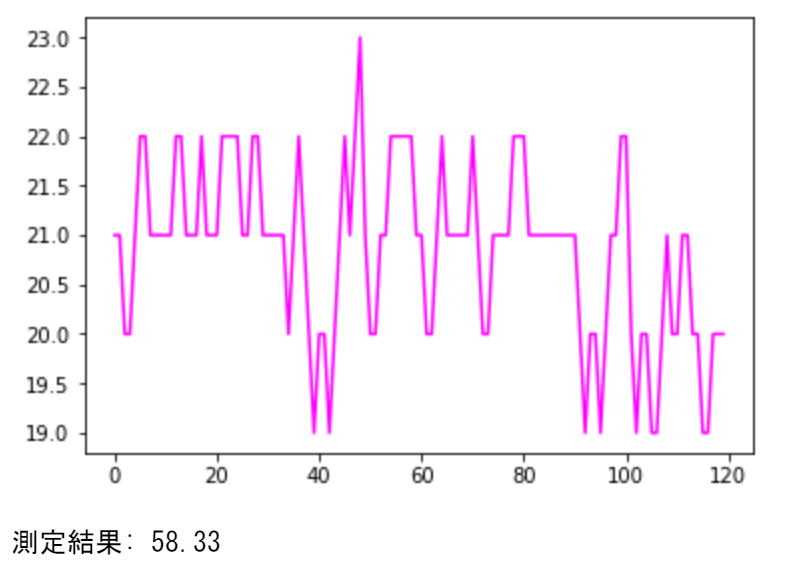

# measuring_pulse
カメラから読み込んだ画像を使って大まかな脈拍を測るプログラム.

●今回のプログラムは、以下のサイトを参考に作成しました.  
- https://ensekitt.hatenablog.com/entry/2017/12/19/200000
  - PythonのOpenCVでカメラの画像を扱う方法についての記事．
  - どう画像を読み込むかの流れについて参考にさせて貰いました．  
- http://opencv.jp/opencv-2svn/py/core_drawing_functions.html#FillConvexPoly
  - 各OpenCVの使い方やそれぞれの引数などについてはこのサイトを元に調べました.  
- http://google-os.blog.jp/archives/50816150.html
  - 脈拍を測定する考え方や実装についての記事．
  - 読み込んだ画像の輝度値のうち、どの成分が変化するかなど理論について参考にしました.
  - また,測定した結果から脈を計算する考え方について参考にさせて貰いました．

●プログラムの概要
  - カメラの画像からおおよその脈拍について測定するプログラム.
  - Python3のver.3.7.3を利用して作成した.
  
  
  - プログラムを起動後、指をカメラの前にセットした後Escキーを押すと、測定が開始.
  - カメラに映った指の画像の輝度値の緑成分を読んでいく.
    - 緑の輝度値が一番安定して測定ができる.
    - 輝度値を読み込む際に中央付近の輝度値がよく変化すると思われる部分を読むようにした.
  - 回数分の測定が終了した後は、測定した輝度値を一度フィルタにかけて少しなめらかにする.
  - その後、グラフにしたときのボトムの数を調べてそれを単位時間中の鼓動数とする.
    - 具体的には、前の値と後の値より小さくなっている部分をボトムとし、その個数を判定する.
  - これを一分単位での鼓動数に変換することでおおまかな脈の測定を実現させた.
  - 測定結果を含めた文字列をカメラ画像に表示させ、Escキーを押すことで処理を終了します.
  - また、端末上に測定結果として輝度値のグラフと測定値を表示させるようにしました.

●実行について  
　●実行の様子  
  
  
  
  ●端末上の表示  

  
